# CollabBoard
A real-time collaborative whiteboard application for brainstorming and drawing together.


## 1. Program Description

CollabBoard is a *real-time* collaborative whiteboard application that allows multiple users to draw, write messages, and brainstorm simultaneously on the same shared canvas. The application is inspired by Figma Jam and Discord Activities Whiteboard, providing various interactive features such as *drawing primitives* (pencil, *shape*, *text*, and *arrow*), real-time tracking of user cursor positions, cursor-based communication via a *chat* feature between users, image uploads, and an undo/redo mechanism. All changes made to the canvas are synchronized live using the WebSocket protocol to ensure data consistency across users.

In its implementation, CollabBoard applies a distributed client-server architecture with several asynchronous Python-based backend servers running behind Nginx as a reverse proxy and request traffic manager. The frontend is developed as a web-based application using HTML5, CSS, and JavaScript to handle rendering and user interaction with the canvas. In addition, for data management, CollabBoard uses PostgreSQL as the DBMS for permanent data storage and Redis Pub/Sub as the inter-server communication mechanism for real-time event synchronization, and also uses Redis to manage temporary data (*ephemeral state*, e.g., user activity and canvas changes that need to be forwarded to all users who have joined the same room). CollabBoard also implements an automatic deletion mechanism for canvases with no activity for 24 hours, in order to optimize storage usage.


## 2. High-Level Architecture

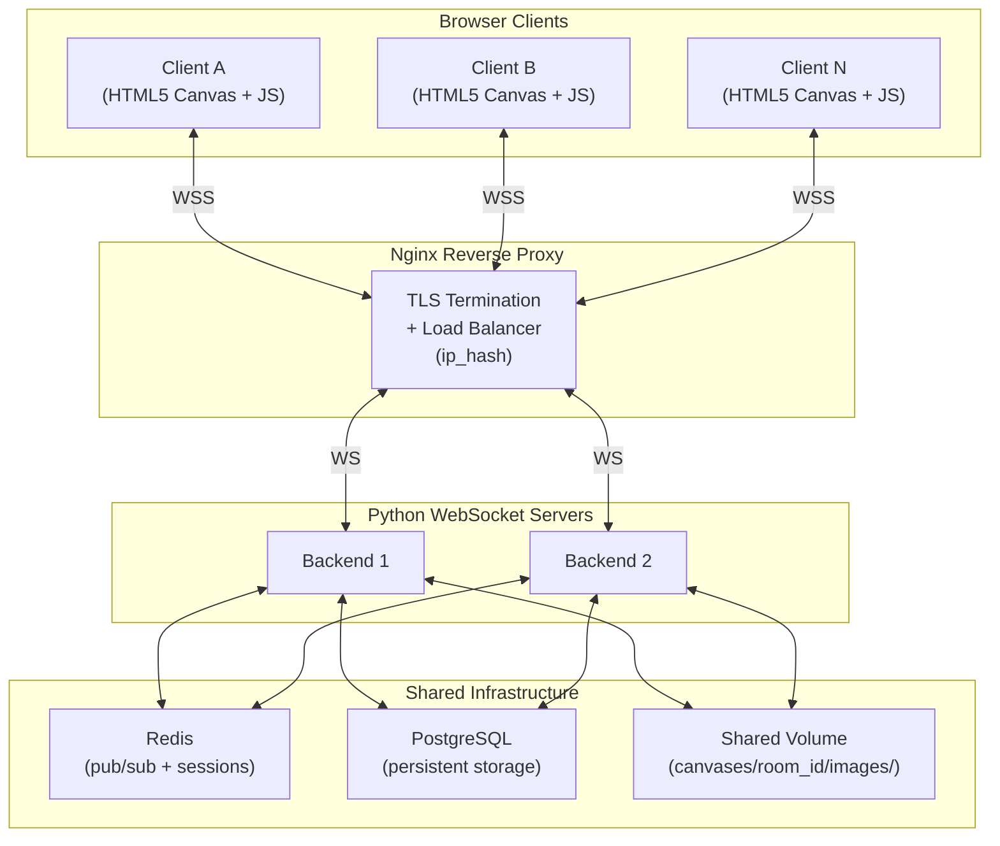

### 2.1 Network Protocol — WebSocket Framing

All messages are sent as **WebSocket text frames** containing a single JSON object in UTF-8 encoding. WebSocket provides built-in message framing (RFC 6455), so no application-level length prefix is needed.

- Each WebSocket text frame contains exactly one JSON message.
- The `"type"` field in the JSON object serves as the message discriminator.
- For binary data (image uploads), the image bytes are **base64-encoded** within the JSON payload.

---

## 3. Component Responsibilities

### 3.1 Server Components

| Component | Responsibility |
|----------|----------------|
| **WebSocket Handler** | Accepts WebSocket connections; manages per-connection state; routes incoming JSON to the Room Manager / Sync Engine; handles cleanup when a connection is dropped. Replaces the previous TCP Connection Manager. |
| **Room Manager** | Creates / deletes rooms; tracks membership; enforces the maximum user limit (global, via PostgreSQL); generates room codes |
| **Sync Engine** | Receives client operations; assigns a global sequence number via an atomic PostgreSQL increment; broadcasts to local WebSocket peers and publishes to Redis pub/sub for cross-server relay; maintains the authoritative canvas state in PostgreSQL |
| **Persistence Engine** | Serializes canvas state to the PostgreSQL `saved_canvases` table; saves uploaded images to the shared filesystem; handles save/load requests; runs periodic autosave (using a Redis distributed lock to prevent duplication) |
| **Cleanup Scheduler** | An async task that runs every 6 hours (with a Redis distributed lock); deletes rooms whose `last_activity` exceeds 24 hours via a PostgreSQL `DELETE` with `ON DELETE CASCADE` |
| **Static File Server** | Serves frontend browser assets (HTML, CSS, JS) over HTTP |

### 3.2 Client Components (Browser)

| Component | Responsibility |
|----------|----------------|
| **WebSocket Layer** (`app.js`) | Connects to `wss://<host>/ws`; sends/receives JSON messages; handles `onopen`, `onmessage`, `onclose`; implements reconnection with exponential backoff |
| **Canvas Renderer** (`canvas.js`) | An HTML5 `<canvas>` element with `CanvasRenderingContext2D`; renders all drawing objects, remote cursors, cursor chat bubbles, and uploaded images |
| **Tool Manager** (`tools.js`) | Manages the active tool state (pencil, rectangle, circle, etc.); translates `mousedown`/`mousemove`/`mouseup` events into drawing operations |
| **Color Picker** | An HTML `<input type="color">`; stores the current stroke and fill colors |
| **Undo/Redo Manager** (`undo.js`) | Maintains a local action stack; sends undo/redo operations to the server via WebSocket |
| **Image Handler** | An HTML `<input type="file" accept="image/png,image/jpeg">`; reads and base64-encodes images via the `FileReader` API; sends upload operations |
| **UI Controller** (`ui.js`) | Toolbar, status bar, join/create-room modal, participant list, cursor chat input |

---

## 4. Room Lifecycle

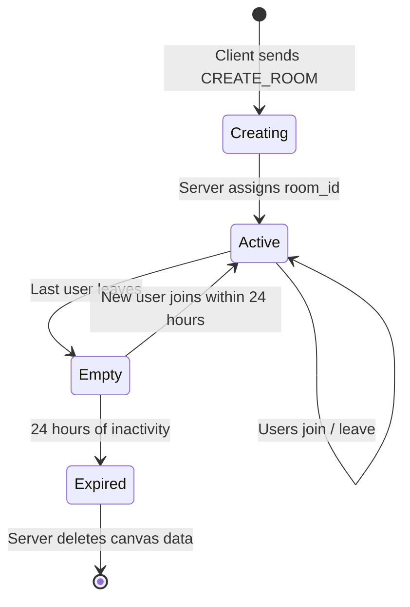

| Event | Action |
|-------|----------|
| **Create Room** | The client sends `create_room` with a username. The server creates a 6-character alphanumeric `room_id`, creates an empty canvas state, and responds with `room_created` containing the room_id. |
| **Join Room** | The client sends `join_room` with a room_id and username. The server validates that the room exists and is under capacity (8 users). If successful, the server sends a full canvas snapshot to the joining user, then broadcasts `user_joined` to all other users. |
| **Leave Room** | The client sends `leave_room` or the connection drops. The server removes the user from the room, broadcasts `user_left`, and removes their cursor. |
| **Last User Leaves** | The server triggers an automatic canvas save. The room state remains in memory for 5 minutes (a grace period), after which it is removed. Canvas data remains saved on disk. |
| **Rejoining an Empty Room** | If canvas data exists on disk, the server loads it and recreates the room state in memory. |
| **Room Expiration** | The Cleanup Scheduler checks the `last_activity` timestamp. If it exceeds 24 hours, the entire `canvases/<room_id>/` directory is deleted. |

---

## 5. Canvas Lifecycle

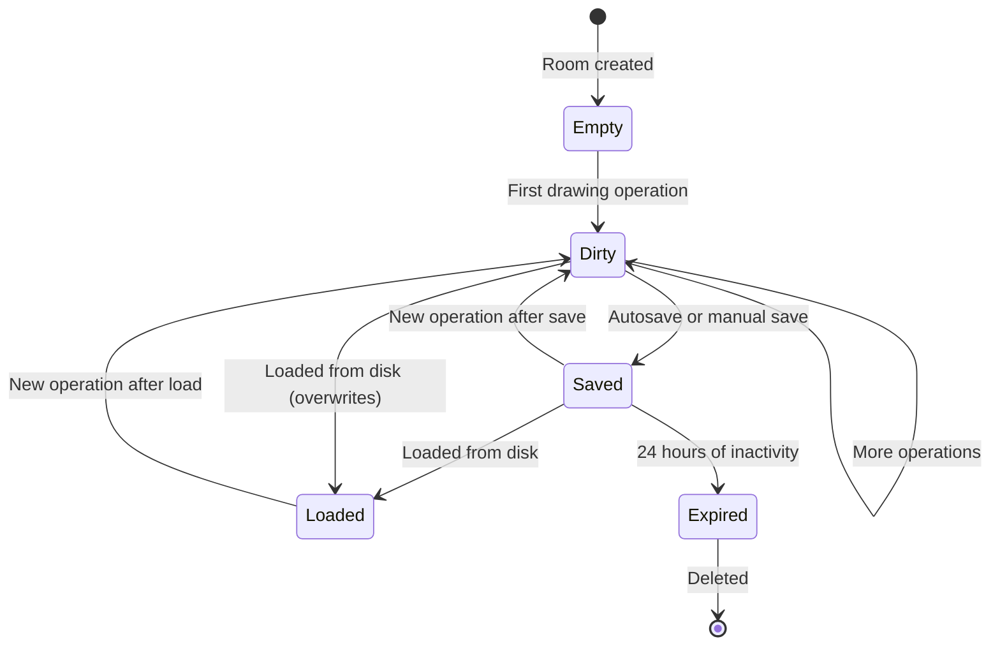

| Event | Action |
|-------|----------|
| **Drawing Operation** | An object is added/modified on the canvas. The `last_activity` timestamp is updated. The canvas is marked dirty. |
| **Autosave** | Triggered every **60 seconds** if the canvas is in a dirty state. Writes `canvas.json` + image files to disk. Marks the canvas as clean. |
| **Manual Save** | The client sends `save_canvas`. The server saves to disk immediately regardless of dirty status. The server responds with `save_ack` and a timestamp. |
| **Load Canvas** | The client sends `load_canvas` with a room_id. The server reads `canvas.json` from disk, replaces the in-memory state, and broadcasts the full canvas snapshot to all clients in the room. |
| **Export** | Client-side only. The client renders the canvas to a PIL image and saves it locally as PNG. Does not involve the server. |

### 5.1 Canvas State Structure (In Memory)

The canvas is an **ordered list of objects**. Each object has:

| Field | Description |
|-------|-----------|
| `obj_id` | A UUID string, globally unique |
| `obj_type` | One of: `pencil`, `text`, `rectangle`, `circle`, `line`, `arrow`, `heart`, `image` |
| `created_by` | The creator's `user_id` (UUID) — references the `users` table |
| `created_at` | ISO 8601 timestamp |
| `z_index` | Integer for drawing order (higher = on top) |
| `color` | RGB hex string, e.g. `"#FF5733"` |
| `stroke_width` | Integer, in pixels |
| `properties` | Type-specific properties (see below) |

**Type-specific properties:**

| Type | Properties |
|------|----------|
| `pencil` | `points: [[x,y], ...]` — a list of coordinate pairs |
| `text` | `x, y, content, font_size` |
| `rectangle` | `x, y, width, height, fill_color` (nullable) |
| `circle` | `cx, cy, radius, fill_color` (nullable) |
| `line` | `x1, y1, x2, y2` |
| `arrow` | `x1, y1, x2, y2` (rendered with an arrowhead at x2,y2) |
| `heart` | `cx, cy, size` |
| `image` | `x, y, width, height, image_id` (references a file on disk) |

---

## 6. Synchronization Model

### 6.1 Strategy: Authoritative Server Broadcast

The server holds the single source of truth for canvas state. All mutations flow through the server, which assigns a monotonically increasing **sequence number** and broadcasts to every client in the room.

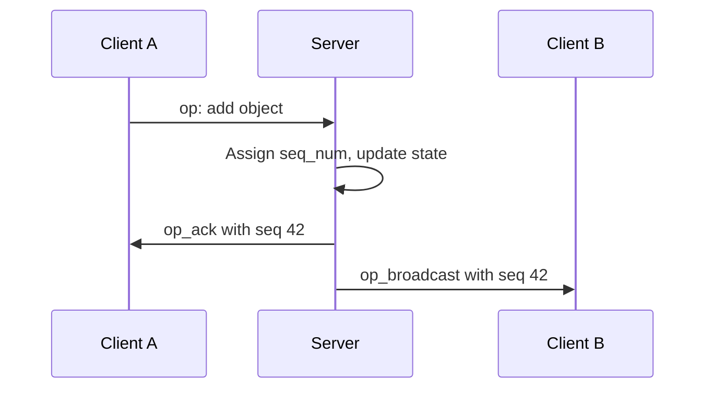

### 6.2 Operation Types

| Operation | Description |
|---------|-----------|
| `add` | Adds a new object to the canvas |
| `delete` | Deletes an object by `obj_id` |
| `modify` | Updates properties of an existing object (partial update) |
| `cursor_move` | Updates the sender's cursor position (unsequenced, fire-and-forget) |
| `cursor_chat` | Broadcasts a cursor chat message |

### 6.3 Cursor Synchronization

- Cursor positions are *broadcast* at a **rate-limited 20 updates/second** per client (minimum interval of 50 ms).
- Cursor messages are **unsequenced** and **not persisted**. They are stateless fire-and-forget.
- Each cursor update contains: username, x coordinate, and y coordinate.
- The server forwards cursor updates to all other clients in the room without storing them.

### 6.4 Cursor Chat

- Activated when a user presses the `/` key on the keyboard.
- A small text input appears near the user's cursor on their client.
- On submit (Enter), the client sends a `cursor_chat` message with the username, x, y, and message content.
- The server broadcasts it to all peers. Receiving clients display a speech-bubble overlay at the specified position.
- The bubble automatically disappears after **4 seconds** on each receiving client.

---

## 7. Persistence Model

### 7.1 Storage Layout

```
data/
└── canvases/
    ├── A1B2C3/
    │   ├── canvas.json          # serialized canvas state
    │   ├── meta.json            # room metadata
    │   └── images/
    │       ├── img_uuid1.png
    │       └── img_uuid2.jpg
    └── X4Y5Z6/
        ├── canvas.json
        ├── meta.json
        └── images/
```

### Contents of meta.json

| Field | Description |
|-------|-----------|
| `room_id` | 6-character alphanumeric code |
| `created_at` | ISO 8601 timestamp |
| `last_activity` | ISO 8601 timestamp (updated on every operation and when users join/leave) |
| `last_saved` | ISO 8601 timestamp |
| `total_objects` | Integer count of objects on the canvas |

### 7.2 Autosave

1. A server-side timer fires every **60 seconds**.
2. For each active room with `is_dirty = True`, the server atomically serializes the canvas state to `canvas.json` (writes to `.tmp` then renames).
3. `meta.json` is updated with a new `last_saved` timestamp.
4. `is_dirty` is reset to `False`.

### 7.3 Image Upload Flow

1. The client reads the file (max 2 MB) and base64-encodes it.
2. The client sends an `add` operation with `obj_type: "image"` and `image_data` containing the base64 string.
3. The server decodes the base64 data and writes the file to `images/<uuid>.<ext>`.
4. The server stores only the `image_id` reference in the canvas state (not the full base64 data).
5. The server broadcasts the add operation with `image_id` (without `image_data`).
6. Receiving clients request the image via `image_request` with the `image_id`.
7. The server responds with `image_response` containing the base64-encoded image data.

### 7.4 Canvas Snapshot on Join

When a client joins a room, the server sends the full canvas state:

1. A `canvas_snapshot` message containing all objects and the current sequence number.
2. For each image object, the client must request the image data separately via `image_request`.

### 7.5 Automatic Deletion

- The Cleanup Scheduler thread runs every **6 hours**.
- It scans all `meta.json` files under `data/canvases/`.
- If `last_activity` is more than **24 hours** from the current time, the entire room directory is deleted via `shutil.rmtree()`.
- Active rooms (with connected clients) are never deleted regardless of the `last_activity` value.

---

## 8. Undo/Redo Model

### 8.1 Strategy: Per-User Local Action Stack

Each client maintains its own undo and redo stacks. Undo/redo only affects objects created or modified by that user.

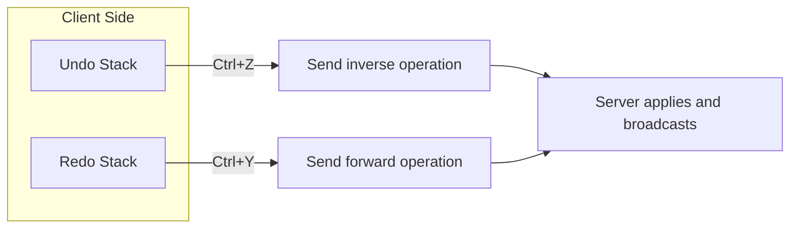

### 8.2 Action Table

| Action | Undo Stack | Redo Stack | Network Effect |
|------|---------------|---------------|---------------|
| User draws object X | Push inverse: delete X | Clear | Send `add X` to server |
| User presses Ctrl+Z | Pop inverse, send | Push forward: add X | Send `delete X` to server |
| User presses Ctrl+Y | Push inverse: delete X | Pop forward, send | Send `add X` to server |
| User modifies the color of object X | Push inverse: modify X to old_color | Clear | Send `modify X` to server |
| User presses Ctrl+Z after a modification | Pop inverse, send | Push forward: modify X to new_color | Send `modify X` to server |

### 8.3 Rules

1. **A new action clears the redo stack.** Once a user performs a new operation, redo history is discarded.
2. **Maximum stack depth: 50 operations.** The oldest entry is dropped when the stack exceeds 50.
3. **Undoing an already-deleted object:** If the object has since been deleted by another user, the undo becomes a no-op. The server responds with `op_rejected` with reason `object_not_found`, and the client silently discards that undo entry.
4. **Undo is limited per user.** User A cannot undo User B's actions.

---

## 9. Concurrency Model

### 9.1 Async Server Architecture

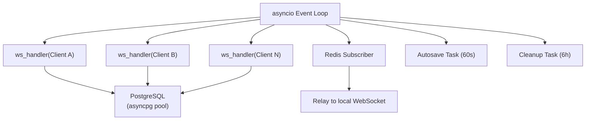

### 9.2 Async Task Model

| Task | Count | Purpose |
|------|--------|--------|
| Event Loop | 1 per backend | Runs all async coroutines for one backend instance |
| WebSocket Handler | 1 per client | Loops `async for message in websocket`; deserializes JSON; dispatches to room logic |
| Redis Subscriber | 1 per backend | Subscribes to room channels; forwards cross-server broadcasts to local WebSocket connections |
| Autosave Task | 1 per backend | Loops `asyncio.sleep(60)`; iterates over dirty rooms; protected by a Redis distributed lock |
| Cleanup Task | 1 per backend | Loops `asyncio.sleep(21600)`; deletes expired rooms; protected by a Redis distributed lock |

### 9.3 Locking Strategy

| Resource | Lock Type | Granularity |
|-------------|------------|--------------|
| Room canvas state (seq_counter) | PostgreSQL row-level lock | Per-room (atomic `UPDATE ... RETURNING`) |
| Room capacity check (join) | PostgreSQL `SERIALIZABLE` transaction | Per-room |
| Cross-room registry | PostgreSQL `SELECT COUNT(*)` | Global |
| Autosave cycle | Redis `SETNX lock:autosave EX 55` | Global (one backend at a time) |
| Cleanup cycle | Redis `SETNX lock:cleanup EX 21600` | Global (one backend at a time) |

### 9.4 Conflict Resolution

Because the server is authoritative and uses PostgreSQL row-level locks:

1. All operations on a room's `seq_counter` are **serialized** via a PostgreSQL row-level lock (`UPDATE rooms SET seq_counter = seq_counter + 1 ... RETURNING`). Concurrent operations from different backends wait on the lock, ensuring monotonic ordering.
2. Two users editing the same object simultaneously: **last-write-wins**. The second `modify` operation overwrites the first.
3. One user deletes an object while another modifies it: the deletion wins. The modification receives `op_rejected`.
4. This is intentionally kept simple. For 2–8 users on a whiteboard, conflicts are rare and last-write-wins is acceptable.

### 9.5 Client Concurrency

| Context | Purpose |
|---------|--------|
| Main thread (browser) | JavaScript event loop; renders the canvas; handles user input; processes WebSocket messages |

The browser client is **single-threaded** (JavaScript event loop). WebSocket messages arrive via `ws.onmessage` and are processed synchronously within the event loop. No threading or worker threads are required — the browser's event-based model replaces the three-thread architecture used in the desktop version.

---

## 10. Team Responsibilities

### 10.1 Role Assignments

| Member | Role | Primary Ownership |
|---------|-------|-------------------|
| **Muhammad Quthbi Danish Abqori** | Server & DevOps Engineer | WebSocket server, Room Manager, Nginx configuration, Docker Compose, Redis integration |
| **Muhammad Zaky Zein** | Frontend Engineer | Browser UI (HTML5 Canvas + JS), Canvas Renderer, Tool Manager, Color Picker, Image Handler |
| **Isabella Sienna Sulisthio** | Sync & Data Engineer | Sync Engine, PostgreSQL persistence, Undo/Redo Manager, Cleanup Scheduler, Redis pub/sub |

### 10.2 Shared Responsibilities

- WebSocket message format (agreed upon on Days 1–2)
- Integration testing
- Bug fixes during stabilization

### 10.3 Collaboration Boundaries

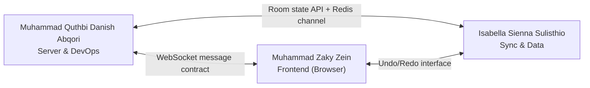

---

## 11. Explanation of Each Component

### 11.1. Database

#### 11.1.1. ER Diagram

```
┌──────────────┐       ┌────────────────┐       ┌──────────────────┐
│    users     │       │     rooms      │       │  saved_canvases  │
├──────────────┤       ├────────────────┤       ├──────────────────┤
│ PK user_id   │       │ PK room_id     │◄──┐   │ PK save_id       │
│   username   │       │    created_at  │   │   │ FK room_id       │
│   color_hex  │       │   last_activity│   │   │    saved_at      │
│   created_at │       │    last_saved  │   │   │    save_type     │
└──────┬───────┘       │    is_dirty    │   │   │    snapshot_json │
       │               │    total_obj   │   │   │    total_objects │
       │               │    status      │   │   │    seq_at_save   │
       │               │    seq_counter │   │   └──────────────────┘
       │               └───────┬────────┘   │
       │                       │            │
       │  ┌────────────────┐   │            │
       │  │  room_members  │   │            │
       │  ├────────────────┤   │            │
       └─►│ FK user_id     │   │            │
          │ FK room_id     │◄──┘            │
          │    joined_at   │                │
          └────────────────┘                │
                                            │
┌──────────────────┐   ┌──────────────┐     │
│ canvas_objects   │   │    images    │     │
├──────────────────┤   ├──────────────┤     │
│ PK obj_id (UUID) │   │ PK image_id  │     │
│ FK room_id       │◄──┤ FK room_id   │     │
│ FK created_by    │   │ FK obj_id    │     │
│    obj_type      │   │    filename  │     │
│    z_index       │   │    mime_type │     │
│    color         │   │    file_size │     │
│    stroke_width  │   │   uploaded_at│     │
│    properties    │   └──────────────┘     │
│    created_at    │                        │
│    is_deleted    │                        │
└──────────────────┘                        │
                                            │
┌──────────────────┐                        │
│ action_history   │                        │
├──────────────────┤                        │
│ PK action_id     │                        │
│ FK room_id       │────────────────────────┘
│ FK user_id       │
│    seq_num       │
│    op_type       │
│    obj_id        │
│    forward_data  │
│    inverse_data  │
│    created_at    │
└──────────────────┘
```

#### 11.1.2. Custom Types

```sql
CREATE TYPE room_status AS ENUM ('active', 'empty', 'expired');
CREATE TYPE obj_type    AS ENUM ('pencil', 'text', 'rectangle', 'circle', 'line', 'arrow', 'heart', 'image');
CREATE TYPE op_type     AS ENUM ('add', 'delete', 'modify');
CREATE TYPE save_type   AS ENUM ('auto', 'manual');
CREATE TYPE mime_type   AS ENUM ('image/png', 'image/jpeg');
```

#### 11.1.3. Purpose of Each Table

- `users`: The system records every user who is currently connected. There is no authentication process; each user is identified by their display name. A UUID primary key is used to avoid ambiguity in cases of duplicate or reused usernames.
- `rooms`: Used to store room metadata. Each room has a 6-character alphanumeric code. This component maps directly to the fields of the `meta.json` specification as well as its runtime state.
- `room_members`: Tracks which users are currently present in a given room. This component enforces a maximum capacity of 8 users. The data in this table is transient.
- `canvas_objects`: Used to store all drawing objects on the canvas within a room. Object properties are stored in JSONB format for flexibility across different shape types, while the `z_index` attribute determines the display order of objects on the canvas.
- `images`: Tracks image files that have been uploaded and stored on disk in the `canvases/<room_id>/images/` directory, and links those images to their respective canvas objects.
- `action_history`: Used as a server-side operation log to facilitate the undo/redo function. Each row records one sequenced operation. This log stores both forward and inverse data as JSONB. It is capped at a maximum of 50 actions per user within a single room.
- `saved_canvases`: Used to store canvas snapshots from the autosave feature (every 60 seconds) and manual saves. The `snapshot_json` column holds the entire serialized canvas state in JSONB format, for queryability and for direct serialization to clients.

### 11.2. Backend

#### 11.2.1. `main.py` (Entry Point)

- **`lifespan(app)`**: Manages the processes that run on server startup and shutdown. This includes initializing the database *pool*, the Redis connection, and running background tasks such as the *pub/sub subscriber* and *autosave*.
- **`websocket_endpoint(websocket)`**: Handles the entire lifecycle of a client connection, from the *handshake* (`hello`), server capacity validation, through to processing the various message types (`ping`, `op`, `cursor_move`).

#### 11.2.2. `connection.py` (WebSocket Management)

- **`register()` & `disconnect()`**: Registers a new client by assigning a UUID v4, and removes it upon disconnection.
- **`broadcast_to_room()`**: Sends a message to all clients in a given room that are connected to that particular local server.

#### 11.2.3. `rooms.py` (Room Logic)

- **`handle_create_room()`**: Generates a unique 6-character room ID, stores it in the DB, and automatically adds its creator to the room.
- **`handle_join_room()`**: Validates that the room exists, checks the maximum capacity (8 people), then sends a `canvas_snapshot` (the current canvas state) to the newly joined user.
- **`handle_disconnect_cleanup()`**: Removes the user from the DB and Redis, then broadcasts a `user_left` message to other users when someone disconnects.

#### 11.2.4. `sync.py` (Canvas Synchronization)

- **`handle_op()`**: Acts as a *router* that directs messages based on the `op` value.
- **`_handle_add()`**: Validates object data using Pydantic, extracts and saves *base64* image data to local disk storage (if the object is an image), and inserts the data into PostgreSQL.
- **`_handle_delete()`**: Performs a *soft delete* by setting the `is_deleted = TRUE` column instead of fully removing the data from the database.

#### 11.2.5. `db.py` (Database)

- **`insert_room_member()`**: Uses the `SERIALIZABLE` isolation level to prevent *race conditions* when many users attempt to join a full room simultaneously.

#### 11.2.6. `redis_client.py` & `pubsub.py` (Distributed Server)

- **`create_session()` & `refresh_session_ttl()`**: Stores user status in Redis with a 300-second time-to-live (TTL). The TTL is refreshed every time the user performs an activity.
- **`start_subscriber()` & `_handle_message()`**: Runs continuously (`while True`) listening on the Redis `room:*` channels and relays cross-server messages to local clients.

#### 11.2.7. `cursor.py` (Real-Time Interaction)

- **`handle_cursor_move()`**: Validates that the cursor position is within the canvas coordinate bounds (maximum 1920x1080).

#### 11.2.8. `tasks.py` (Background Tasks)

- **`autosave_loop()`**: Runs every 60 seconds to scan for changed rooms (`is_dirty = TRUE`), creates a canvas snapshot in JSON format, then resets the dirty status.

#### 11.2.9. `models.py` (Data Schema Validation)

- **`AddObjectPayload`**: Ensures the object type matches the allowed *enum* list (e.g., `pencil`, `rectangle`), and ensures the color code matches the `#RRGGBB` *hex* format.

### 11.3. Frontend

#### 11.3.1. `network.js` (WebSocket Communication)

- **`EventEmitter`**: A lightweight *event* system that lets other parts of the application (such as the UI or Canvas) "listen" for specific messages from the *server* (for example, listening for `hello_ack` or `user_joined` messages) without having to modify the networking file's code directly.
- **`_startPingCycle()`**: Sends a *ping* message every 10 seconds and waits for a *pong* reply within 5 seconds to detect whether the *server* has died silently (*silent death*).

#### 11.3.2. `canvas.js` (Canvas & Cursor Rendering)

- **`renderLoop()`**: Runs continuously (60 *frames* per second) using `requestAnimationFrame`. On every *frame*, this function clears the entire canvas and redraws all objects based on their visual order (`z_index`).
- **`CursorManager`**: Manages other users' cursors. Cursors are not drawn inside the canvas itself (to avoid smearing/artifacts), but are instead rendered as absolutely-positioned HTML `div` elements (`#cursor-overlay`) that move on top of the canvas using GPU acceleration (`transform: translate`).

#### 11.3.3. `tools.js` (Drawing Interaction Management)

- **`getLogicalCoordinates(e)`**: Converts the user's physical screen pixels (which can vary in size) into the application's standard logical resolution of 1920x1080.
- **`processImage(file)`**: Shrinks/compresses an image locally in the *browser* before sending it to the *server*, if the image size exceeds the 2MB limit.

#### 11.3.4. `undo.js` (Undo/Redo Management)

- **`_computeInverse(action)`**: Finds the "opposite" of an action. If the action is a draw (`add`), its inverse is a delete (`delete`). If the action is a modification (`modify`), its inverse is reverting it back to its previous value.
- **`updateObjectId()`**: Because objects initially use a placeholder ID (`temp-`), this function swaps the placeholder ID in the undo history with the real ID assigned by the PostgreSQL *backend* database.

#### 11.3.5. `main.js` (Global Logic & Keyboard *Shortcuts*)

- **`openCursorChatInput()`**: Opens a *floating* chat box at the last known cursor position, triggered by pressing the forward slash `/` key on the keyboard.

#### 11.3.6. `ui.js` (UI & Room Controls)

- **`handleConnect(action)`**: Validates the name and room code input in the modal (the initial *popup* window), and ensures the join button stays in a *loading* state until the *server* confirms the connection.
- **`_renderParticipants()`**: Dynamically builds the participant list HTML elements (*sidebar* and avatars in the top bar) and automatically generates a unique color for each user based on the characters of their name (`_hueFromUsername`).

#### 11.3.7. `index.html` & `css/style.css`

Website structure and visual design.

## Installation

1. Clone the repository:
   ```bash
   git clone https://github.com/ch-tato/collabboard.git
   cd collabboard
   ```
2. Set up environment variables (if required, copy `.env.example` to `.env`).
3. Start the application using Docker Compose:
   ```bash
   cd infra
   docker-compose up -d
   ```

## Usage

1. Open your browser and navigate to `http://localhost`.
2. Click **Create Room** to start a new collaborative session.
3. Share the generated 6-character room code with other users.
4. Other users can join by entering their name and the room code.
5. Start drawing, adding images, and chatting via the cursor chat (press `/`)!

## Contributing

We welcome contributions! Please see our [CONTRIBUTING.md](CONTRIBUTING.md) for details on how to get started.

## License

This project is licensed under the MIT License - see the LICENSE file for details.

## Result Screenshots
1. View when a user attempts to create a room:

    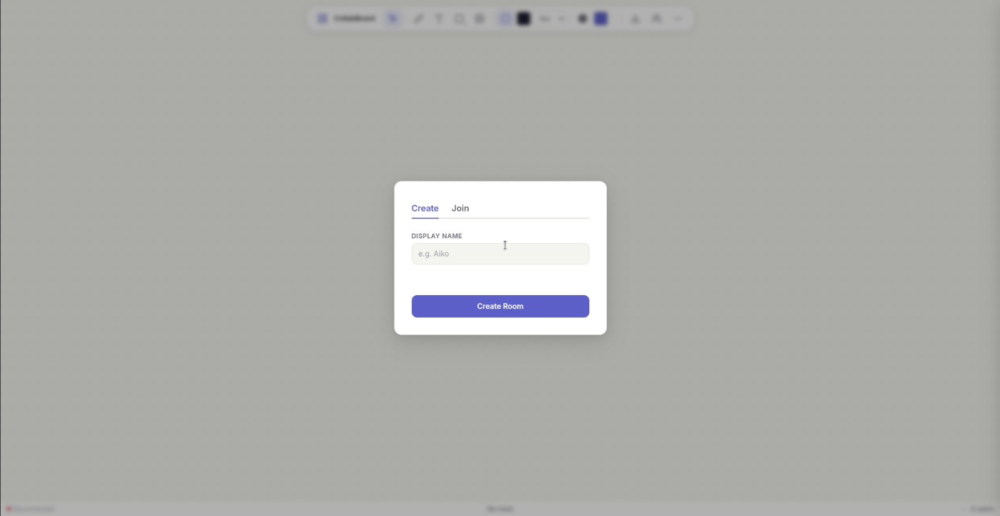

1. View when a user attempts to join a room:

    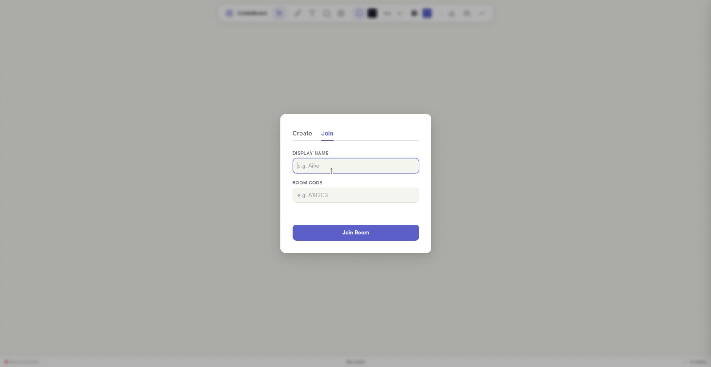

1. View when a user first enters a room:

    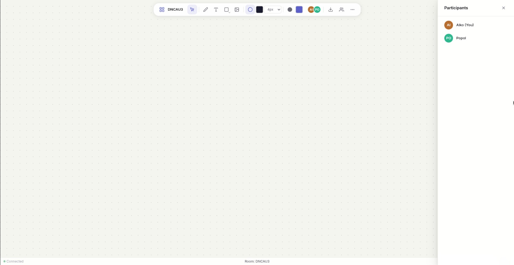

1. Main tools in CollabBoard:

    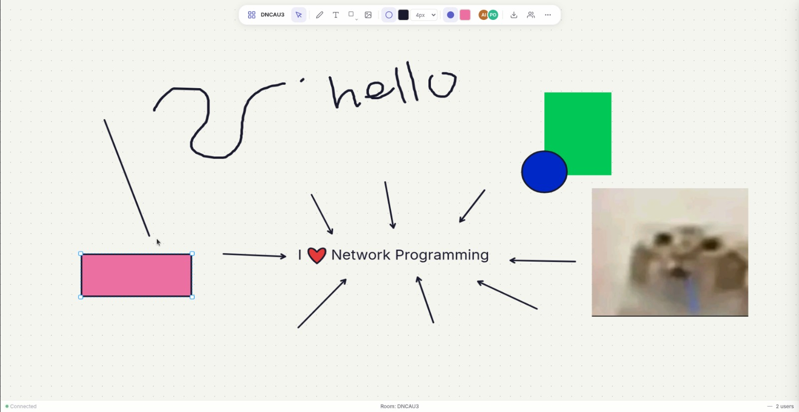

1. Add image & selection feature:

    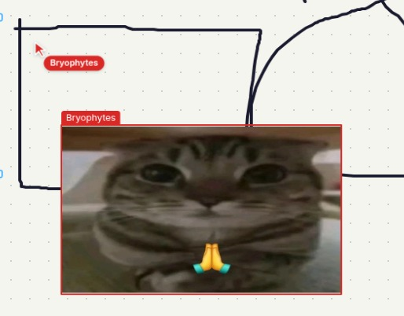

1. Real-time stroke and cursor streaming:

    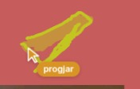

1. Cursor chat feature:

    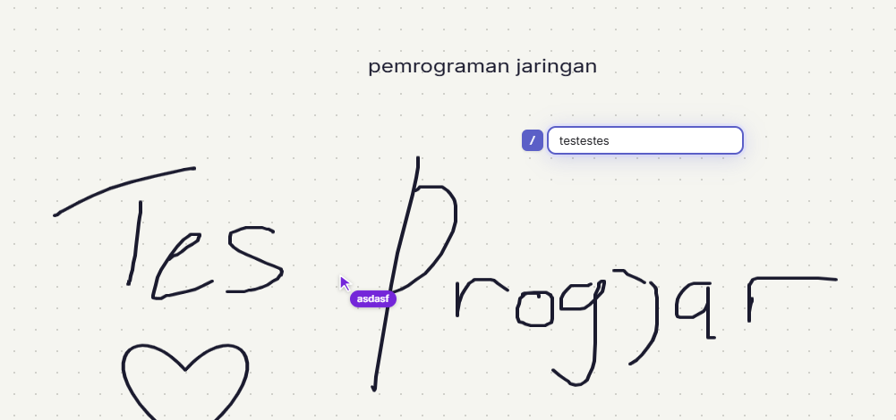

1. Viewing the list of users who joined the same room:

    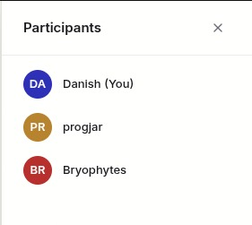

1. View when a user attempts to leave a room:

    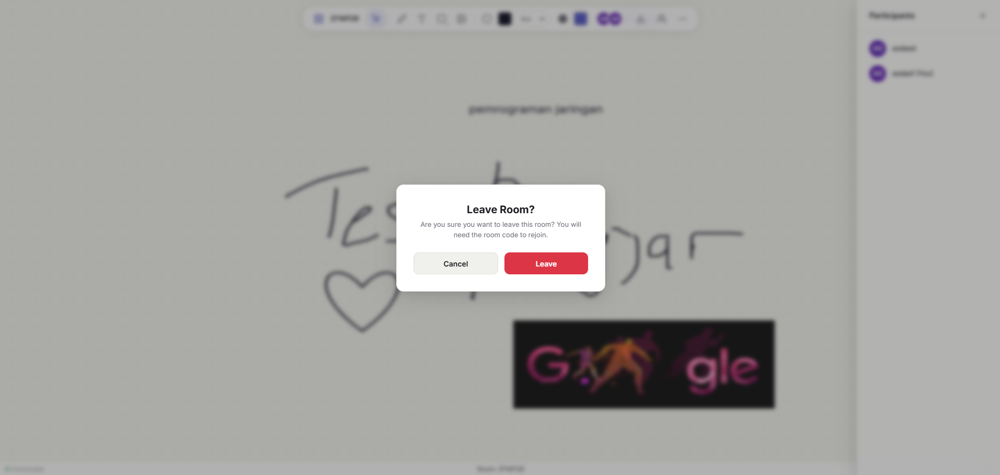
